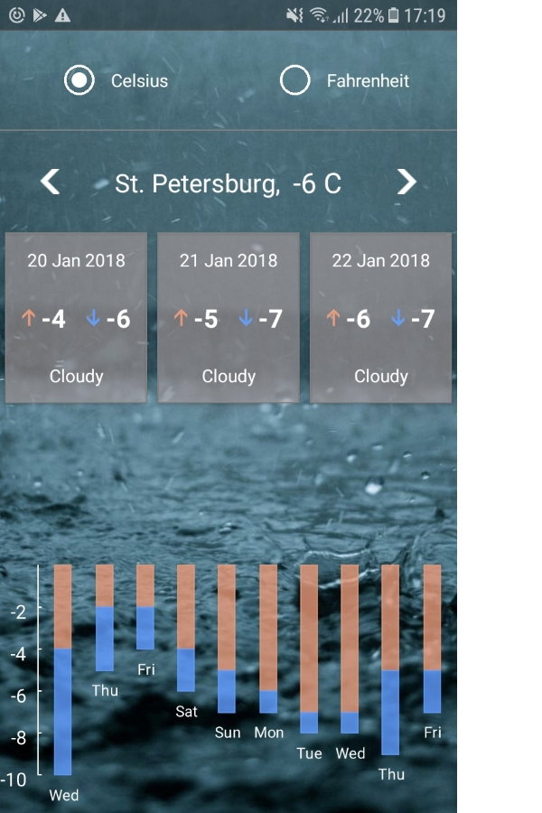

## This is the source code for the weather app

#### Features
* Shows 10 days weather forecast for your location
* Sliding weather cards
* Bar chart for high and low temperature
* Offline mode

#### To view the app with your phone (Android or IOS) 
* Install Expo client from [App Store](https://itunes.apple.com/app/apple-store/id982107779?ct=www&mt=8)
 or [Google Play](https://play.google.com/store/apps/details?id=host.exp.exponent&referrer=www)
* Open Expo client and scan QR code from [here](https://expo.io/@slava-lu/weather)  

#### To run it locally
* In local project directory run `yarn` to load modules.
* Run `yarn start` to start the app.
* Scan the QR code you will see in the console with the Expo client
